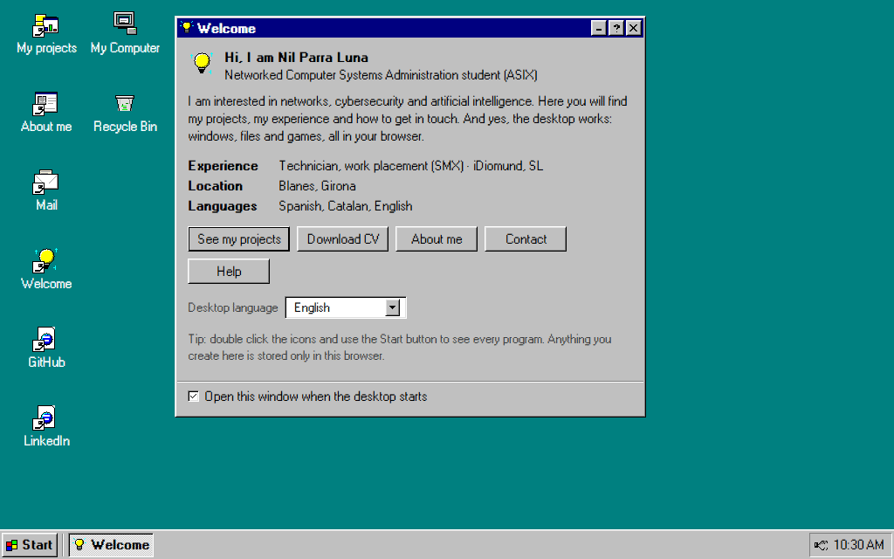

# Nil Parra Luna

<p align="center">Personal website built as an interactive Windows 95 desktop.</p>

<p align="center">
  <a href="https://github.com/nilparra-dev/nilparra.dev/actions/workflows/ci.yml"></a>
  
</p>

<p align="center">
  <a href="docs/architecture.md">Architecture</a> ·
  <a href="CONTRIBUTING.md">Contributing</a> ·
  <a href=".github/SECURITY.md">Security</a>
</p>

<p align="center"></p>

Open the site and Windows 95 boots: windows, a Start menu, a taskbar and a virtual disk. My CV,
my projects and my contact details live there as files. Everything runs in the browser, with no
backend and no emulator underneath. Each program is a React application driven by a window
manager.

## What you can do

- Move, resize and minimise the windows. The desktop remembers their position on the next visit.
- Browse `C:\` with Explorer or the command prompt, create and edit files, send them to the
  recycle bin and export them to your real computer.
- Play Klondike Solitaire and no-limit Texas Hold'em against computer opponents.
- Search the web from the Internet window. Results appear inside the window and each link opens
  in a real browser tab.
- Read it in English, the default, or switch the interface to Spanish or Catalan.
- Link straight to a window: `#projects`, `#projects/wooster`, `#about` and `#contact` open it on
  top of the desktop, and the Projects window copies the link of the project on screen.

## How it is built

- React 19, TypeScript and Vite. The production build is a static folder that runs on any file
  host.
- The window manager (`src/core/window/`) is a pure reducer. One state tree holds geometry,
  z-order, focus and minimise state, and `localStorage` persists the layout.
- The virtual disk (`src/core/fs/`) is a small file system on IndexedDB: folders, text and binary
  files, recycle bin, search, import and export.
- The portfolio lives in typed modules under `src/core/content/`. The same data feeds the
  Welcome, About, Projects and Explorer windows.
- All artwork is generated by `scripts/`. A hand-written PNG encoder draws the 52 icons, the
  cursors, the wallpaper patterns, the site logo (a terminal window with a `>_` prompt) and the
  browser icons made from it (ICO, SVG, apple-touch and the PWA sizes); `npm run assets` rebuilds
  them and writes review sheets to compare against period references.
- The landing page carries the whole metadata set: Open Graph and X cards with a real preview
  image, `canonical`, `robots.txt`, a one-URL `sitemap.xml` and a web manifest. The `ProfilePage` structured data and a plain HTML copy of the portfolio (for
  link previews, crawlers that skip JavaScript and visitors without it) are built from
  `src/core/content/` during the build, so they can never contradict what the desktop shows.
- Klondike and Hold'em run on plain TypeScript engines with tests. The poker engine handles hand
  evaluation, blinds, side pots and bot opponents.
- The translation catalogues are compiler-checked. `es.ts` is the source of truth, and a missing
  key in `ca.ts` or `en.ts` fails the build.
- CI (`.github/workflows/ci.yml`) runs the type check, the Vitest and Testing Library suite,
  and a production build on every pull request.

More detail in [`docs/architecture.md`](docs/architecture.md).

## Running it locally

Node.js 20 or newer.

```bash
npm install
npm run dev      # development server at http://localhost:5173
npm run build    # type check plus static build in dist/
npm test         # test suite
npm run tunnel   # public https address for the dev server, to try it on a phone
npm run preview:cloudflare  # the build served as in production, headers included
```

## Deployment

`npm run build` writes everything to `dist/`, ready for any static host. Production is
**https://nilparra.dev/**, served by Cloudflare Workers static assets with no Worker script:

- `wrangler.jsonc` sets the assets directory, the single-page fallback (unknown paths answer with
  `index.html`) and the custom domain, for which Cloudflare creates the DNS record and the
  certificate.
- `public/_headers` adds the security headers (the Content-Security-Policy with
  `frame-ancestors`, HSTS, `X-Frame-Options`, `Permissions-Policy`…) and caches `/assets/*` for a
  year, since those file names change with their contents.
- `.github/workflows/deploy.yml` runs the tests, builds and calls `wrangler deploy` on every push
  to `main`, so each merged pull request is published. It can also be run by hand (**Actions →
  Deploy to Cloudflare → Run workflow**). It reads `CLOUDFLARE_API_TOKEN` and `CLOUDFLARE_ACCOUNT_ID` from the `production`
  environment of the repository. The token only needs the *Edit Cloudflare Workers* template,
  limited to the account and the `nilparra.dev` zone.

`www.nilparra.dev` is not a route of the Worker. In the Cloudflare zone it is a proxied
`AAAA www → 100::` record with a redirect rule (template *Redirect from WWW to root*) that sends
it to the apex with a 301.

The canonical domain is written down in one place, `VITE_SITE_URL` in `vite.config.ts`, which
fills in the `canonical`, the Open Graph tags and the structured data during the build. The route
in `wrangler.jsonc`, `public/robots.txt` and `public/sitemap.xml` mirror it, so change all four
together. The `SITE_URL` repository variable overrides it for the build only.

`main` is protected. Changes go through pull requests that pass CI, and commit messages are
written in English.

## Credits and trademark notice

The source code and resources created specifically for this repository are released under the
[MIT licence](LICENSE), unless stated otherwise. The bundled MS Sans Serif fonts are generated
from [React95](https://github.com/react95-io/React95); their provenance, modifications and
embedded CC BY-SA 3.0 metadata are documented in
[`src/assets/fonts/README.md`](src/assets/fonts/README.md) and
[`src/assets/fonts/NOTICE.md`](src/assets/fonts/NOTICE.md). The classic pointer follows
[JS Paint](https://github.com/1j01/jspaint) under the MIT licence. School, company and project
logos, tool marks and other third-party assets retain their own terms; see the README files under
[`public/education`](public/education), [`public/experience`](public/experience),
[`public/portfolio`](public/portfolio) and
[`public/wallpapers/windows95`](public/wallpapers/windows95).

Windows is a registered trademark of Microsoft Corporation. This is an unofficial tribute, not
affiliated with Microsoft. The repository includes an archived set of Windows 95 wallpaper
bitmaps, documented in
[`public/wallpapers/windows95/README.md`](public/wallpapers/windows95/README.md).
