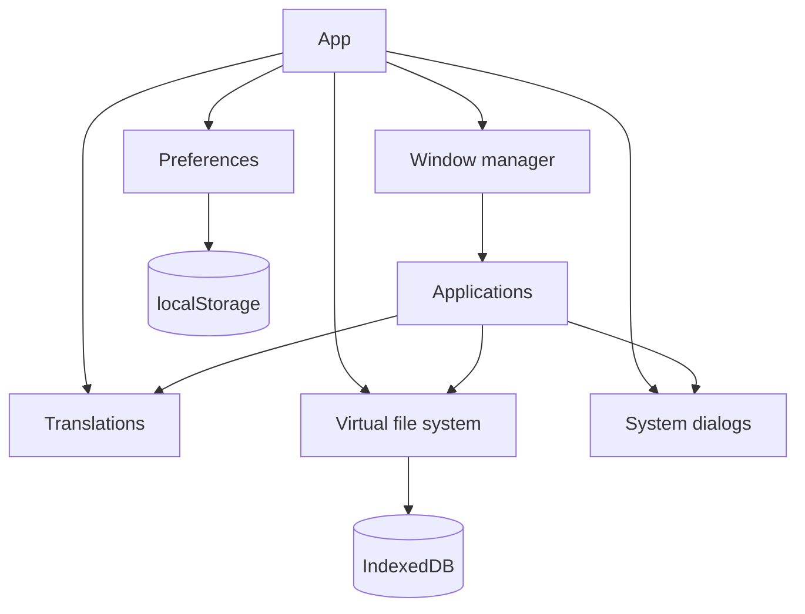

# Architecture

The site is a single-page React application. `src/main.tsx` mounts `App`, which stacks the
providers that make up the runtime, and `Shell` renders the desktop. There is no router and no
backend: everything happens in the browser and the URL never changes.

## Providers

| Provider | Responsibility |
| --- | --- |
| `PreferencesProvider` | language, wallpaper, sounds and accessibility; persisted to `localStorage` |
| `I18nProvider` | es/ca/en catalogues and `Intl` date and number formats |
| `WindowManagerProvider` | window list, z-order, focus and layout |
| `VfsProvider` | virtual disk: seeding, file operations, clipboard |
| `DialogProvider` | message, prompt, open/save and properties dialogs |
| `MenuLayerProvider` | one shared menu layer, so menus can leave their window |

## Window manager (`src/core/window/`)

A reducer over a single state tree. `windowManagerReducer` handles a small set of actions:
`open`, `close`, `focus`, `minimize`, `maximize`, `restore`, `toggle`, `move`, `resize`,
`setViewport`, `minimizeAll`, `closeAll`, `resetLayout` and `hydrate`. `layout.ts` cascades new
windows and clamps them to the desktop, and `layoutPersistence.ts` saves the session, restores it
on the next visit and drops windows of applications that no longer exist.

## Virtual file system (`src/core/fs/`)

Two IndexedDB stores: `nodes` (metadata, indexed by parent and deletion time) and `blobs`
(binary content). `vfs.ts` exposes the operations over them, and `FsError` carries typed codes
that the interface translates. `seed.ts` creates the first disk (system folders and the
portfolio) and `display.ts` resolves translated display names without touching the stored paths.
The portfolio folder is read only and can be restored from the Control Panel. On boot, `vfs.ts`
also removes the copies an older non-atomic initialisation could leave behind, and only when the
copies are untouched: the visitor's files are never touched.

## Applications (`src/core/apps/`)

`catalog.ts` describes each application (icon, size, menu group, handled extensions) without
importing components, so any module can ask which application opens a file. `launcher.tsx` opens
windows through the window manager and deduplicates `single` applications by id and document
windows by `docKey`. `components.ts` maps catalogue ids to their React components.

## Pixel scale and typography (`src/ui/pixelScale.ts`)

MS Sans Serif is drawn on an 11 px grid and the icons are pixel art, so both
only stay sharp when one interface pixel covers a whole number of screen
pixels. Before React mounts, `installPixelScale` sets the page zoom to
`scale / devicePixelRatio`, where `scale` is an integer chosen to keep text
near 16.5 CSS px without leaving less than 800x520 interface pixels (320x480
on phones). It is recomputed on resize and when the pixel ratio changes, and
the Control Panel lets the visitor force another scale that fits.

Stylesheets follow the same grid: text is 11 px (22 px for the few large
headings), line heights are whole pixels (`--w95-line-ui`, `--w95-line-read`)
and secondary text uses `--w95-text-muted`, which passes WCAG AA on every
surface.

## Persistence

`src/core/persist/storage.ts` wraps `localStorage` with a versioned envelope (`{version, data}`).
Reads are defensive: private mode, cleared storage or an old schema return the fallback instead
of breaking the desktop.

## Content and translations

- The portfolio is data: `src/core/content/` holds `profile.ts`, `projects.ts`, `help.ts`,
  `branding.ts` and `portfolioFiles.ts`, which turns that data into the files of `C:\Portfolio`.
- Missing values are marked as placeholders and the interface labels them. The site never
  presents invented content as real.
- `src/core/i18n/es.ts` is the source of truth. `ca.ts` and `en.ts` are typed as complete
  records, so a missing key fails `npm run typecheck`.

## Generated artwork (`scripts/`)

Everything visible is generated from code. `scripts/lib/` contains a PNG encoder and the drawing
primitives; `scripts/art/` draws the icons, the cursors and the wallpaper patterns. `npm run
assets` writes to `src/assets/generated/`, `src/styles/cursors.generated.css` and the review
sheets under `qa/` (ignored by git). `predev` and `prebuild` run it automatically.

## SEO and metadata

There is no router, so the site has exactly one address and the landing document has to carry all
of the metadata itself. `index.html` holds the prose (title, description, Open Graph, X card,
canonical, robots) and the seo plugin of `vite.config.ts` fills in the two things that cannot be
written by hand:

- `%SITE_URL%`, the canonical domain. `%BASE_URL%` only carries the path, and social networks and
  search engines need the scheme and the host. The domain is written once, as `VITE_SITE_URL`,
  and `public/CNAME`, `public/robots.txt` and `public/sitemap.xml` mirror it.
- `%STRUCTURED_DATA%`, a `ProfilePage` with a `Person` inside, built from `PROFILE`, `studies`,
  `links` and `skills`. Generating it means the description a crawler reads cannot drift from the
  one the desktop shows, and optional sections simply do not appear while their content is empty.

The plugin fails the build when a marker is missing or duplicated: a literal `%STRUCTURED_DATA%`
would be visible text to the visitor, and silent structured data is worse than a broken build.

The `404.html` that the Pages workflow copies from `index.html` is marked `noindex`, since Pages
answers unknown paths with a 404 status and the copy must never compete with the landing page.

## Security

Security controls and the production hardening plan are documented in [security.md](security.md):
the CSP meta and frame guard, the sandboxed embeds, the storage normalisation and the pipeline
rules (pinned actions, audit gate, least-privilege deployment).

## Tests and CI

Vitest with jsdom and `fake-indexeddb`. Unit tests cover the window reducer, layout persistence,
the virtual file system and the game engines; smoke tests mount every application inside its real
providers and catch missing translations. `.github/workflows/ci.yml` runs the type check, the
tests and the build on every pull request and on `main`.
