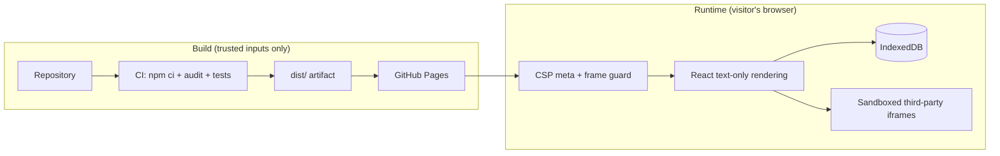

# Security architecture

The desktop is a static single-page application with no backend, no accounts and no
server-side state: the virtual disk lives in the visitor's IndexedDB and leaves the
browser only when they export a file. There is therefore no server to breach — the
attacker's only targets are the visitor's browser session and the repository/pipeline
that produces the published files. The controls below are organised around those two
surfaces.

## Runtime controls

| Control | Where | Threat it addresses |
| --- | --- | --- |
| Content-Security-Policy meta | `index.html` | XSS payload exfiltration, third-party script injection, `object`/`base` abuse. `script-src 'self'` only; there is no inline script anywhere in the bundle. |
| Frame guard | `src/main.tsx` | Clickjacking. Pages cannot send `X-Frame-Options`/`frame-ancestors`, so a client-side guard breaks out of hostile frames and blanks the page when navigation is impossible. |
| Sandboxed embeds | `InternetApp`, `ViewerApp` | Third-party sites and `blob:` documents run without `allow-top-navigation`/`allow-popups`, so they cannot escape or act as the site. |
| Text-only rendering | all apps | File contents, web results and profile data are always rendered as React text nodes, never as HTML. The codebase contains no `dangerouslySetInnerHTML`, `eval` or `document.write`. |
| Scheme allowlist for navigation | `useFileOpener` | Shortcuts and URLs are validated as `http(s)` (or the shortcut's own types) before `window.open`, blocking `javascript:`/`data:` pivots. |
| Storage normalisation | `src/core/fs/vfs.ts` | Tampered IndexedDB records (by another site's script, an extension or an old version) are shape-checked on load: names, shortcut targets, depths and types. |
| Keyless remote calls | `websearch` | The only cross-origin `fetch` is Tavily's keyless endpoint, reflected in `connect-src`. No API keys exist client-side. |

## Supply chain and pipeline

- **Reproducible installs**: CI and deployment use `npm ci` against the committed
  lockfile; Dependabot keeps it current.
- **Pinned actions**: every GitHub Actions step is pinned to a full commit SHA, so a
  compromised action tag cannot inject code into the deployment.
- **Least-privilege deployment**: the Pages workflow requests only `pages: write` and
  `id-token: write`, and publishes through a manual dispatch while the site is not public.
- **Audit gate**: `npm audit --omit=dev` runs in CI; vulnerabilities fail the build.
- **Protected main**: changes reach production only through pull requests with a green
  CI run.

## Production hardening for nilparra.dev

The Pages origin (`*.github.io`) cannot send response headers. Serving the custom
domain through Cloudflare (free tier) in front of Pages closes that gap:

1. **Headers at the edge** (Transform Rules / response header rules):
   - `Content-Security-Policy` — move the meta policy to a real header and drop
     `style-src 'unsafe-inline'` once styles are extracted; keep the meta as fallback.
   - `X-Frame-Options: DENY` and `Cross-Origin-Opener-Policy: same-origin` — real
     clickjacking and window-reference defences, on top of the frame guard.
   - `Referrer-Policy: strict-origin-when-cross-origin` (already implicit in the embeds,
     which set `referrerPolicy="no-referrer"`), `X-Content-Type-Options: nosniff`,
     `Permissions-Policy: camera=(), microphone=(), geolocation=()`.
   - `Strict-Transport-Security: max-age=63072000; includeSubDomains; preload` once the
     domain is stable.
2. **DNS/DNSSEC and TLS**: DNSSEC at the registrar, Cloudflare proxy on, TLS mode
   "Full (strict)" is not possible with Pages certificates — use "Full" and keep
   "Always Use HTTPS" enabled so plaintext never answers.
3. **Caching integrity**: Pages already serves immutable hashed assets; the edge rule
   only forwards, never rewrites, HTML.
4. **Monitoring**: Cloudflare Web Analytics (cookieless, fits the CSP with one
   `connect-src` host if self-hosted, or zero scripts if using the beacon host — add it
   to the policy when adopted). No cookies, so no consent banner is needed.
5. **Domain control**: keep the `CNAME` record to `nilparra.github.io`, verify the
   domain in GitHub settings so it cannot be claimed by a deleted/recreated repository.

## Incident and maintenance posture

- **Reporting**: `.github/SECURITY.md` asks for private email reports instead of
  public issues, with an acknowledgement and fix timeline.
- **Secrets**: none exist by design. If one is ever needed (e.g. a paid search API), it
  must live behind a serverless proxy on the domain, never in the bundle — the CSP's
  `connect-src` would then list only that proxy.
- **Review cadence**: rerun `npm audit` and the pattern searches
  (`dangerouslySetInnerHTML|innerHTML|eval|new Function|document.write`) before each
  release; both are also enforced in CI.
