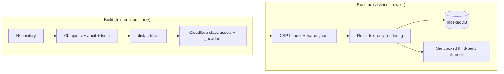

# Security architecture

The desktop is a static single-page application with no backend, no accounts and no
server-side state: the virtual disk lives in the visitor's IndexedDB and leaves the
browser only when they export a file. There is therefore no server to breach — the
attacker's only targets are the visitor's browser session and the repository/pipeline
that produces the published files. The controls below are organised around those two
surfaces.

## Runtime controls

| Control | Where | Threat it addresses |
| --- | --- | --- |
| Content-Security-Policy | `public/_headers`, `index.html` | XSS payload exfiltration, third-party script injection, `object`/`base` abuse. `script-src 'self'` only; there is no inline script anywhere in the bundle. Trusted Types (`require-trusted-types-for 'script'; trusted-types 'none'`) makes the browser reject any HTML string written to the DOM, even from a dependency. Sent as a header in production; the meta copy covers `vite dev` and `vite preview`, and `src/csp.test.ts` keeps both equal. |
| Anti-framing headers | `public/_headers` | Clickjacking. `frame-ancestors 'none'` and `X-Frame-Options: DENY`. |
| Frame guard | `src/main.tsx` | Clickjacking on hosts that do not send the headers above: breaks out of hostile frames and blanks the page when navigation is impossible. |
| Transport and browser policy headers | `public/_headers` | HSTS (`includeSubDomains; preload`), `X-Content-Type-Options: nosniff`, `Referrer-Policy`, `Cross-Origin-Opener-Policy: same-origin` and a `Permissions-Policy` that turns off camera, microphone, geolocation, payment, USB and Topics. |
| Sandboxed embeds | `InternetApp`, `ViewerApp` | Third-party sites and `blob:` documents run without `allow-top-navigation`/`allow-popups`, so they cannot escape or act as the site. |
| Text-only rendering | all apps | File contents, web results and profile data are always rendered as React text nodes, never as HTML. The codebase contains no `dangerouslySetInnerHTML`, `eval` or `document.write`. |
| Scheme allowlist for navigation | `useFileOpener` | Shortcuts and URLs are validated as `http(s)` (or the shortcut's own types) before `window.open`, blocking `javascript:`/`data:` pivots. |
| Storage normalisation | `src/core/fs/vfs.ts` | Tampered IndexedDB records (by another site's script, an extension or an old version) are shape-checked on load: names, shortcut targets, depths and types. |
| Keyless remote calls | `websearch` | The only cross-origin `fetch` is Tavily's keyless endpoint, reflected in `connect-src`. No API keys exist client-side. |

## Supply chain and pipeline

- **Reproducible installs**: CI and deployment use `npm ci` against the committed
  lockfile; Dependabot keeps it current.
- **Pinned actions**: every GitHub Actions step is pinned to a full commit SHA, so a
  compromised action tag cannot inject code into the deployment.
- **Least-privilege deployment**: the deploy workflow has `contents: read` only. The
  Cloudflare token lives in the `production` environment, so no pull request job can read
  it, and is limited to editing Workers on one account and one zone. The `production`
  environment only accepts deployments from `main`, and every push there publishes.
- **Audit gate**: `npm audit --omit=dev` runs in CI; vulnerabilities fail the build.
- **Code scanning**: CodeQL (GitHub default setup) analyses the TypeScript and the
  workflows on every pull request and weekly.
- **OpenSSF Scorecard**: `.github/workflows/scorecard.yml` grades the supply-chain
  practices on every push to `main` and weekly; the findings go to the Security tab and
  the score to the README badge.
- **Protected main**: changes reach production only through pull requests, and the CI
  check is required before merging.

## Production setup for nilparra.dev

1. **Hosting**: Cloudflare Workers static assets (`wrangler.jsonc`), with no Worker
   script. Only the custom domain serves the site: `workers_dev` and `preview_urls` are
   off, so there is no second public host.
2. **Headers**: `public/_headers` (see the runtime controls above). The remaining step is
   dropping `style-src 'unsafe-inline'` once the inline styles are extracted.
3. **DNS, DNSSEC and TLS**: the zone lives in Cloudflare, with DNSSEC signed there and
   the DS record at the registrar. Cloudflare creates the apex record and its certificate
   when the Worker's custom domain is attached. `www` is a proxied placeholder record with
   a redirect rule to the apex. `.dev` is on the browsers' HSTS preload list as a whole,
   so the site is HTTPS only whatever the headers say.
4. **Caching**: `/assets/*` is `immutable` for a year, because Vite names those files
   after their contents; `index.html` is always revalidated.
5. **Monitoring**: Cloudflare Web Analytics is cookieless, so it needs no consent
   banner. Its beacon is a third-party script: adopting it means adding
   `https://static.cloudflareinsights.com` to `script-src` and
   `https://cloudflareinsights.com` to `connect-src`, in both copies of the policy.
6. **Mail**: the domain receives mail through Proton (MX, SPF, DKIM and DMARC records in
   the zone); none of them may be proxied.

## Incident and maintenance posture

- **Reporting**: `.github/SECURITY.md` asks for private reports, through GitHub's
  private vulnerability reporting or by email, instead of public issues.
  `https://nilparra.dev/.well-known/security.txt` (RFC 9116) points at the same channel.
  The build writes it (`src/core/content/securityTxt.ts`) with an `Expires` date a year
  after the build, so every deploy keeps it valid.
- **Secrets**: none exist by design. If one is ever needed (e.g. a paid search API), it
  must live behind a serverless proxy on the domain, never in the bundle — the CSP's
  `connect-src` would then list only that proxy.
- **Review cadence**: rerun `npm audit` and the pattern searches
  (`dangerouslySetInnerHTML|innerHTML|eval|new Function|document.write`) before each
  release; both are also enforced in CI.
